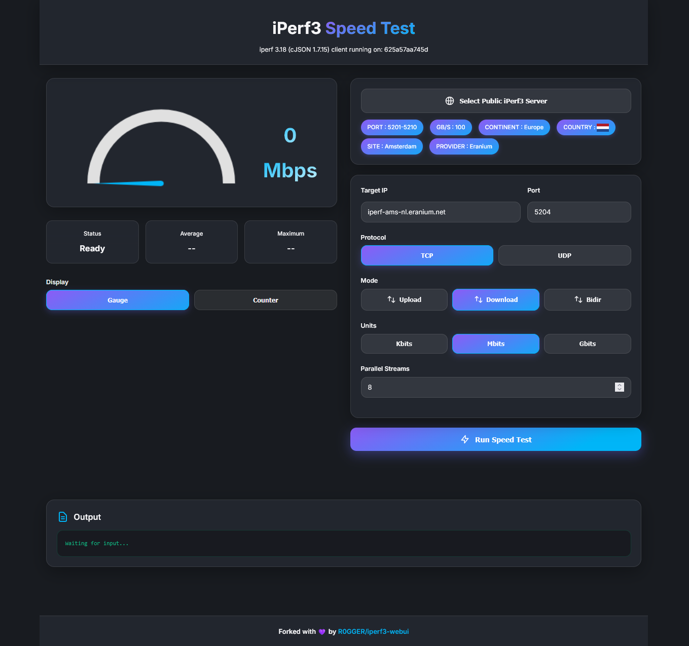

# iPerf3-WebUI

> **Fork Notice:** This project is a fork of [MaddyDev-glitch/iperf3-webui](https://github.com/MaddyDev-glitch/iperf3-webui) and is now maintained independently. It includes additional features, Docker improvements, and UI enhancements not found in the upstream repository.

**iPerf3-WebUI** is a modern, lightweight, web-based frontend for iPerf3, built using Python 3 and Flask.  
Run network speed tests easily from **any device** — macOS, Linux, Windows, or even Android phones (via Termux).

## Features

- **Web-based GUI** — Works in any browser
- **Lightweight & Fast** — Built with Flask and Python 3
- **Live Speedometer** — Real-time results visualization
- **Upload / Download / Bidir modes** — Including bidirectional testing
- **Cross-platform** — Works on desktops, laptops, and mobile
- **Configurable display** — Choose between a speedometer gauge, numeric counter, or let users toggle between both via `display_mode` in `env.yaml`
- **Customizable** — Streams, units (Kbits/Mbits/Gbits), target IP, logos, themes via `env.yaml`
- **Docker-ready** — Pre-built GHCR image and GitHub Actions CI/CD pipeline

---

## Screenshot

---

## Getting Started

### Option 1: Run as Docker Container

```yaml
services:
  iperf3-webui:
    image: ghcr.io/r0gger/iperf3-webui
    container_name: iperf3-webui
    restart: unless-stopped
    ports:
      - 5000:5000
    volumes:
      - ./env.yaml:/app/env.yaml
    environment:
      - FLASK_DEBUG=false
```

```bash
docker compose up -d
```

Or run via the Docker CLI:

```bash
docker run -d -it --name iperf3-webui -p 5000:5000 -v ./env.yaml:/app/env.yaml ghcr.io/r0gger/iperf3-webui
```

Access the Web UI at http://localhost:5000.

### Option 2: Build and run locally in Docker

#### 1. Clone the repository

```bash
git clone https://github.com/r0gger/iperf3-webui.git
cd iperf3-webui
```

#### 2. Build and start

```bash
docker compose up --build -d
```

The app will be available at http://localhost:5000.

---

## Usage

- Enter the **Target IP Address** you want to test against.
- Choose between **TCP** or **UDP**.
- Select **Upload**, **Download**, or **Bidir** mode.
- Set **streams** and **units** if needed.
- Click **Run iPerf3** and watch live results.

---

## Customization

Easily change the app's look and behavior by editing `env.yaml` — no code changes required.

1. Open `env.yaml`.
2. Update values under `logos` and `theme` for your colors, speedometer gradients, and logos.
3. Save and reload the browser tab.

### Display Mode

Control how Upload/Download test results are displayed by setting `display_mode` in `env.yaml`:

| Value     | Description                                                  |
|-----------|--------------------------------------------------------------|
| `gauge`   | Speedometer gauge (default)                                  |
| `counter` | Numeric counter (FAST.com style)                             |
| `both`    | User can toggle between gauge and counter in the UI          |

Bidir mode always uses the counter display regardless of this setting.

```yaml
display_mode: "gauge"   # Options: gauge | counter | both
```

---

## What is iPerf3-WebUI?

iPerf3-WebUI is a parser and wrapper around the official iperf3 client.
It runs iperf3 as a background process, captures its command-line output in real time, and parses the results to present them in a modern, easy-to-use web interface.

Think of it as a lightweight bridge — combining the raw power of iperf3 with a clean, accessible UI for anyone to run network performance tests without touching the terminal.

No changes to iperf3 itself — just smarter, friendlier access to its results.

---

## Changelog

See [CHANGELOG.md](CHANGELOG.md) for a detailed list of changes.

---

## License

This project is licensed under the **MIT License**.  
Feel free to use, modify, and distribute, but please give proper credit.

For more details, see the [LICENSE](LICENSE) file.

---

## Credits

Originally developed by [MaddyDev-glitch (Srimadhaven Thirumurthy)](https://github.com/MaddyDev-glitch).  
Fork maintained by [R0GGER](https://github.com/R0GGER).
